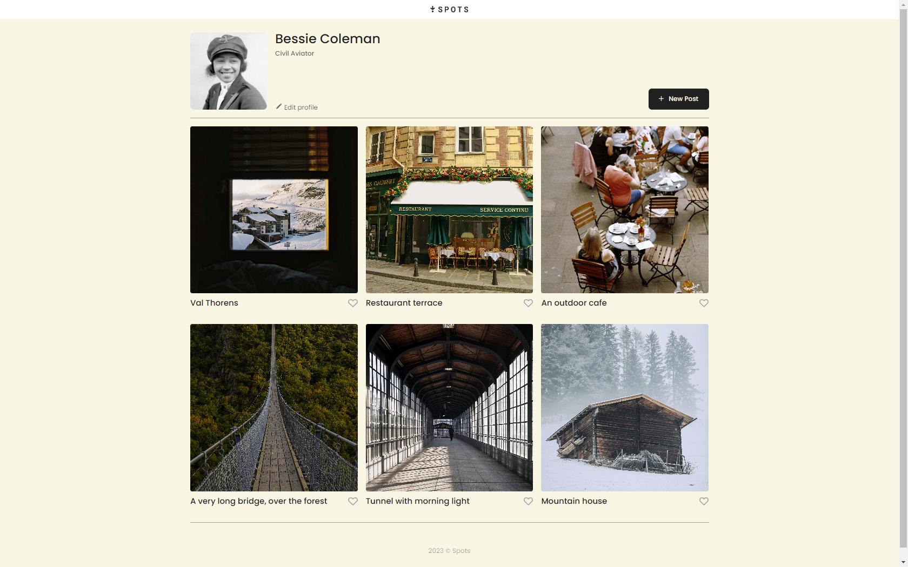

# Project 3: Spots

A social media image sharing website.

## Description

This website allows users to upload images and like other images posted by peers. It also allows for a short profile to be made including a profile picture. It is designed to be compatible with desktop, tablet and phone screens.

## Tech Stack

- HTML
- CSS
- Flex-box
- Grid
- Responsive Design
- BEM
- Custom fonts
- Figma

## Deployment Link

This webpage is deployed on Github pages

- [Deployment Link][https://bsilcox1990.github.io/se_project_spots/]

## Images

## Video explination of website

-[Google drive link][https://drive.google.com/file/d/1EXZUAIo_eMy4Y3ZDVaAdj00R-E3jPCbw/view?usp=drive_link]

<!---

### Overview

- Intro
- Figma
- Images

**Intro**

This project is made so all the elements are displayed correctly on popular screen sizes. We recommend investing more time in completing this project, since it's more difficult than previous ones.

**Figma**

- [Link to the project on Figma](https://www.figma.com/file/BBNm2bC3lj8QQMHlnqRsga/Sprint-3-Project-%E2%80%94-Spots?type=design&node-id=2%3A60&mode=design&t=afgNFybdorZO6cQo-1)

**Images**

The way you'll do this at work is by exporting images directly from Figma — we recommend doing that to practice more. Don't forget to optimize them [here](https://tinypng.com/), so your project loads faster.

Good luck and have fun!
-->

[https://bsilcox1990.github.io/se_project_spots/]: https://bsilcox1990.github.io/se_project_spots/
